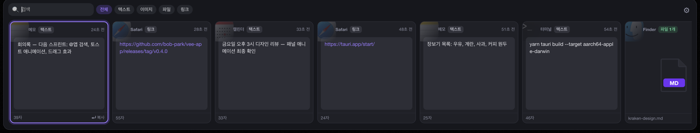
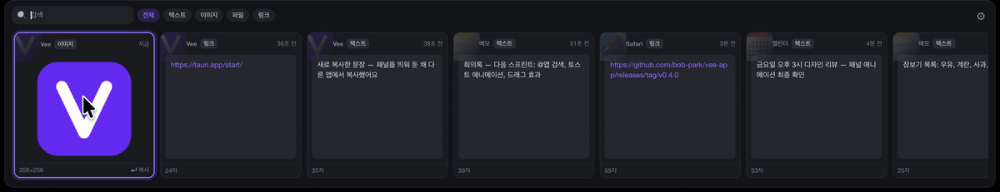
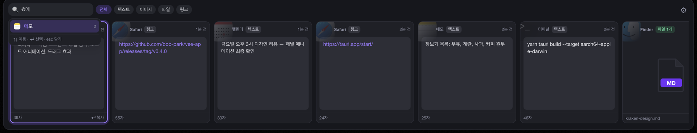
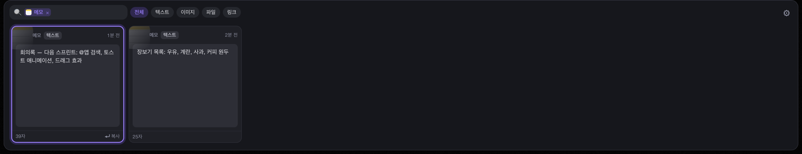
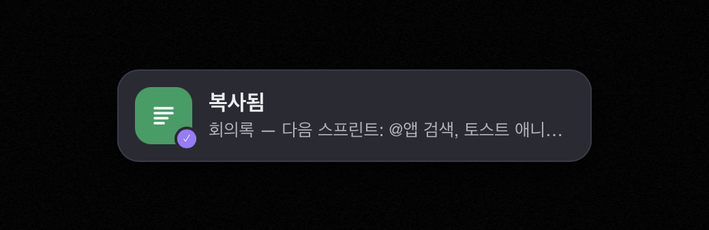

# Vee

복사한 텍스트·링크·이미지·파일을 기록해 두고, 단축키 하나로 화면 하단에 카드로 펼쳐 다시 꺼내 쓰는 클립보드 히스토리 앱입니다. macOS 앱 [Paste](https://pasteapp.io)에서 영감을 받았습니다.

- **지원 OS**: macOS (Apple Silicon), Windows 10/11 (x64)
- **기술 스택**: Tauri 2 (Rust) + React + TypeScript

## 미리보기

| 패널을 띄워 둔 채 복사하면 | 카드를 끌면 |
|---|---|
|  |  |

| `@`로 앱 검색 | 앱 태그로 거르기 |
|---|---|
|  |  |

## 주요 기능

- **클립보드 히스토리**: 텍스트, 링크, 이미지, 파일·폴더 복사를 자동으로 기록합니다. 개수 제한 없이 보관하며, 같은 내용을 다시 복사하면 기존 항목이 맨 앞으로 올라옵니다.
- **카드 패널**: `Cmd+Shift+V`(macOS) / `Ctrl+Shift+V`(Windows)를 누르면 마우스 커서가 있는 모니터 하단에 패널이 올라옵니다. 패널과 카드 크기는 모니터에 맞춰 화면 높이의 약 30%로 정해지며, 큰 모니터에서도 최대 360pt를 넘지 않습니다. 카드 왼쪽 위에는 복사한 앱의 아이콘이 은은한 배경으로 깔리고 앱 이름이 함께 표시되며, 이미지와 이미지 파일은 썸네일로, 그 밖의 파일은 종류별 파일 아이콘으로 보이며, 여러 파일은 겹쳐 쌓인 미리보기로 표시됩니다. 패널을 띄워 둔 채 다른 앱에서 복사하면 기존 카드가 옆으로 밀리고 새 카드가 살짝 빛나며 들어옵니다.
- **검색과 필터**: 패널이 열린 상태에서 바로 타이핑하면 검색됩니다(한글 포함). 전체 / 텍스트 / 이미지 / 파일 / 링크로 걸러 볼 수 있습니다.
- **앱으로 검색**: 검색창에 `@`를 입력하면 복사 기록이 있는 앱 목록이 뜹니다(많이 복사한 순). 앱을 고르면 검색창에 태그가 붙고 그 앱에서 복사한 항목만 보이며, 태그 뒤에 글자를 이어서 쓰면 그 안에서 검색합니다.
- **다시 복사**: 카드를 더블클릭하거나 `Enter`를 누르면 클립보드에 복사되고 "복사됨" 알림이 톡 튀어오르듯 나타나고 효과음이 납니다. 붙여넣기는 원래 앱에서 직접 하면 됩니다.
- **드래그 앤 드롭**: 파일·이미지 카드를 끌면 카드가 커서를 따라 움직이고, 패널 위쪽으로 끌어내 Finder·데스크톱·다른 앱에 놓으면 복사됩니다(원본은 그대로). 패널 안에서 놓으면 제자리로 돌아갑니다. 이미지는 `Vee 2026-10-07 14.32.05.png`처럼 복사한 시각 이름의 PNG 파일로 놓입니다. 끄는 동안 패널은 아래로 비켜납니다.
- **트레이 상주**: 창을 닫아도 종료되지 않고 메뉴바/트레이에 남습니다. 트레이 아이콘을 클릭하면 메뉴(열기 / 설정 / 업데이트 확인 / 종료)가 열리고, "열기"를 누르면 패널이 열립니다.
- **설정**: 테마(시스템/라이트/다크), 언어(시스템/한국어/English), 로그인 시 자동 실행, 복사 효과음(무음·팝·딸깍·차임·방울·톡 중 선택), 개별 삭제 확인, 단축키 변경, 히스토리 전체 삭제
- **자동 업데이트**: GitHub Releases에서 새 버전을 확인해 백그라운드로 내려받고, 사용자가 "업데이트 후 재시작"을 누를 때 설치합니다.

## 설치

[Releases](https://github.com/bob-park/vee-app/releases)에서 최신 버전을 내려받습니다.

| OS | 파일 | 비고 |
|---|---|---|
| macOS (Apple Silicon) | `Vee_<버전>_aarch64.dmg` | Apple 공증을 거친 앱입니다. Intel Mac은 지원하지 않습니다. 보호된 폴더(문서, 다운로드 등)의 파일을 드래그로 꺼내려면 설정에서 **전체 디스크 접근**을 허용하세요. |
| Windows | `Vee_<버전>_x64-setup.exe` | 코드 서명이 없어서 첫 실행 시 SmartScreen 경고가 뜹니다. **추가 정보 → 실행**을 누르세요. |

> v0.4.0은 macOS만 배포했습니다. Windows 최신 버전은 v0.3.2입니다.

## 사용법

| 동작 | 키 |
|---|---|
| 패널 열기/닫기 | `Cmd+Shift+V` / `Ctrl+Shift+V` (설정에서 변경 가능) |
| 카드 이동 | `←` `→`, 마우스 휠 |
| 복사 후 닫기 | `Enter`, 더블클릭 |
| 검색 | 그냥 타이핑 |
| 앱으로 거르기 | `@` + 앱 이름 → `↑` `↓`로 고르고 `Enter` (`Esc`로 취소) |
| 앱 태그 지우기 | 검색창이 비어 있을 때 `Backspace`, 또는 태그의 `×` |
| 필터 전환 | `Tab` / `Shift+Tab` |
| 파일·이미지 꺼내기 | 카드를 끌어다 놓기 |
| 선택한 카드 삭제 | `Delete`, 검색창과 앱 태그가 비어 있을 때 `Backspace` (설정에서 확인 켜면 `Enter`로 확정) |
| 닫기 | `Esc`, 패널 밖 클릭 |

## 개인정보

- 모든 히스토리는 **이 컴퓨터에만** 저장됩니다(SQLite). 외부로 보내지 않으며, 네트워크는 업데이트 확인에만 사용합니다.
- 비밀번호 관리자 등에서 "민감 정보"로 표시한 복사는 저장하지 않습니다.
- 로그에는 복사한 내용이 기록되지 않습니다.

| 항목 | macOS | Windows |
|---|---|---|
| 데이터 (DB, 이미지) | `~/Library/Application Support/com.bobpark.vee/` | `%APPDATA%\com.bobpark.vee\` |
| 로그 | `~/Library/Logs/com.bobpark.vee/` | `%LOCALAPPDATA%\com.bobpark.vee\logs\` |

## 문서

- [개발 환경 구성과 빌드](docs/development.md)
- [릴리스 절차](docs/release.md)
- [설계 문서](docs/superpowers/specs/2026-10-07-vee-clipboard-history-design.md)
- [v0.4.0 설계: 카드 UI · 앱 태그 검색 · 애니메이션](docs/superpowers/specs/2026-10-08-panel-animations-design.md)
